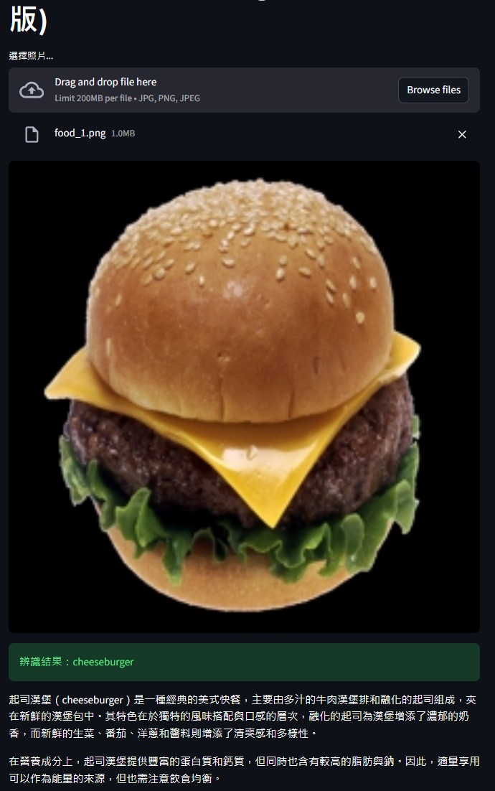

### 🥗 AI 食物辨識與智能營養評論 Agent (OpenAI 版)
# 📌 專案簡介 (ABSTRACT)
本專案實作一個結合 深度學習 (Deep Learning) 與 生成式 AI (AIGC) 的智能食物分析系統。系統核心採用 MobileNetV2 卷積神經網絡進行影像辨識。當使用者上傳食物照片後，系統會準確分類，並透過 OpenAI GPT-4o-mini 扮演專業美食評論家，自動生成美味介紹與營養分析，展示從影像辨識（Recognition）到文字生成（Generation）的完整 AI 應用鏈。

# 📸 Demo 執行結果
圖：系統成功辨識 Cheeseburger 並由 OpenAI 生成專業評論



# 🚀 核心功能與技術實作
影像辨識引擎 (DL)：使用預訓練的 MobileNetV2 模型，針對上傳影像進行特徵提取與物體分類。

智能文案 Agent (AIGC)：串接 OpenAI API (GPT-4o-mini)，根據辨識標籤進行脈絡化創作，生成專業的美食介紹。

部署優化：針對 Streamlit Cloud 環境，優化模型加載速度並確保 API 連線穩定性。

# 🛠️ 技術棧 (Tech Stack)
核心語言: Python 3.11

深度學習: TensorFlow 2.x

網頁框架: Streamlit

生成式 AI: OpenAI API (GPT-4o-mini)

雲端平台: GitHub + Streamlit Cloud

# 📂 專案檔案結構
```Plaintext

.
├── app.py              # 整合 DL 與 OpenAI 的主程式
├── requirements.txt    # 雲端部署套件清單 (含 openai)
├── result.jpg          # Demo 成果截圖
└── README.md           # 本說明文件
```
# 🔧 安裝與部署指南
1. 安全性設定 (Secrets) 本專案不將 API Key 上傳至 GitHub。請在 Streamlit Cloud 的後台 Settings -> Secrets 中填入：

```Ini, TOML

OPENAI_API_KEY = "你的_OPENAI_API_KEY"
```
2. 套件安裝 請確保 requirements.txt 包含以下必要套件：

```Plaintext

tensorflow
streamlit
Pillow
numpy
openai```
# 💬 開發與除錯心得
從 Gemini 轉向 OpenAI：開發過程中曾遇到 Google API 路由 404 錯誤，經與 AI 夥伴多次測試與討論，最終決定更換為穩定性更高的 OpenAI API 架構，成功解決連線問題。

模型輕量化：選用 MobileNetV2 確保在雲端部署環境下仍保有流暢的辨識速度。